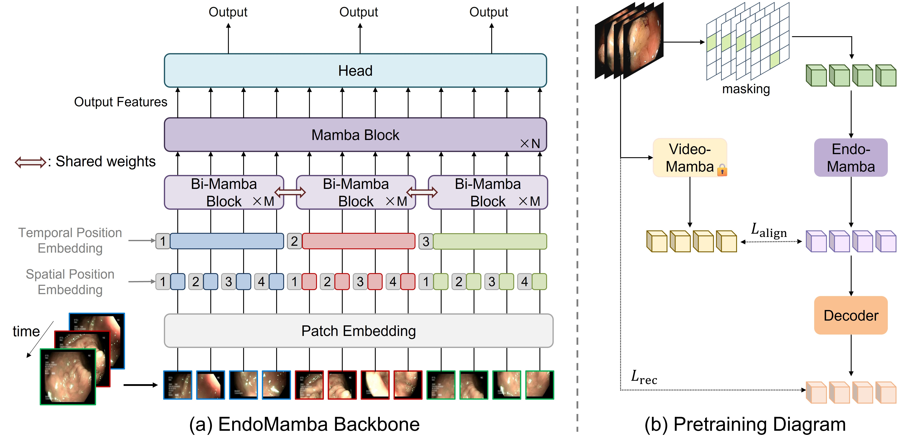

# EndoMamba

[](https://arxiv.org/abs/2502.19090)



This repository provides the code for the paper **EndoMamba: An Efficient Foundation Model for Endoscopic Videos via Hierarchical Pre-training**, which has been provisionally accepted by **MICCAI 2025**.  
👉 [Read the paper on arXiv](https://arxiv.org/abs/2502.19090)

---

## � Quick Start

如果您遇到 `libc10.so: cannot open shared object file` 错误，请使用以下方法之一：

### 方法 1: 使用环境设置脚本
```bash
source setup_environment.sh
cd videomamba/tests
python endomamba_demo.py
```

### 方法 2: 使用 Python 运行器
```bash
python run_endomamba.py
```

### 方法 3: 手动设置环境变量
```bash
export LD_LIBRARY_PATH="$(python -c 'import torch; import os; print(os.path.join(os.path.dirname(torch.__file__), "lib"))'):$LD_LIBRARY_PATH"
cd videomamba/tests
python endomamba_demo.py
```

---

## �🔍 Key Features

- Foundation model designed for **real-time endoscopic video analysis**
- Backbone employs **spatial bidirectional scanning** and **temporal causal scanning** for:
  - Strong spatiotemporal modeling
  - Efficient inference
- Introduces a **hierarchical pre-training strategy** to boost representation learning

---

## ⚙️ Installation

> **Tested Environment** (other variants that support vanilla Mamba should also work):

- Python 3.9 or 3.10  
- CUDA 12.4  
- PyTorch 2.4.1+cu121 or 2.7.0+cu126

### Step-by-step Guide

#### 0. Clone and navigate

```bash
cd <path_to_endomamba>
```

#### 1. Install `causal_conv1d`

> ⚠️ Do **NOT** use the official package. Use local install:

```bash
pip install ./videomamba/causal-conv1d --no-build-isolation
```

#### 2. Install Custom Mamba

> ⚠️ Do **NOT** use the official `mamba-ssm` package. Choose one option:

**Option 1: [Precompiled wheel](https://pan.cstcloud.cn/s/AWWiuQrzTV8) (if your env matches ours):**

```bash
pip install mamba_ssm-2.2.2-cp39-cp39-linux_x86_64.whl
```
or
```bash
pip install mamba_ssm-1.0.1-cp310-cp310-linux_x86_64.whl
```

**Option 2: Build from source:**

```bash
cd ./videomamba/_mamba
export MAMBA_FORCE_BUILD=TRUE
python setup.py clean
rm -rf build/ *.egg-info
pip install . --no-build-isolation --verbose
```

---

## 🚀 Quick Takeaway

If you only want to use our pretrained EndoMamba with your own dataset and dataloader, you can skip dataset preparation. Just follow the installation above, [download pretrained weights](https://pan.cstcloud.cn/s/Wdh1rxF2QRk
) and load EndoMamba into your project.

To test a simple and clean demo of EndoMamba’s efficient parallel and recurrent computation:

```bash
cd videomamba/tests
python endomamba_demo.py
```

---

## 📁 Dataset

### Pretraining

#### Datasets:

- [Colonoscopic](https://www.depeca.uah.es/colonoscopy_dataset/)
- [SUN & SUN-SEG](http://amed8k.sundatabase.org/)
- [LPPolypVideo](https://github.com/dashishi/LDPolypVideo-Benchmark)
- [Hyper-Kvasir](https://datasets.simula.no/hyper-kvasir/)
- [Kvasir-Capsule](https://datasets.simula.no/kvasir-capsule/)
- [CholecTriplet](https://cholectriplet2021.grand-challenge.org/)
- [EndoFM](https://github.com/med-air/Endo-FM)
- [GLENDA v1.0](https://ftp.itec.aau.at/datasets/GLENDA/v1_0/index.html)
- [hSDB-instrument](https://hsdb-instrument.github.io/)
- [EndoMapper](https://www.synapse.org/Synapse:syn26707219/wiki/615178)
- [ROBUST-MIS](https://www.synapse.org/Synapse:syn18779624)

#### Data Preparation:

1. Convert all videos to `.mp4` format.
2. Generate training list:

```bash
cd videomamba/video_sm/datasets/
python generate_train_list.py
```

3. Configure dataset directories in:

```python
videomamba/video_sm/datasets/build.py
```

Edit the `DATASETS_CONFIG` dictionary.

---

###  Downstream Datasets

#### Datasets:

- **Classification**: [PolypGen](https://github.com/med-air/Endo-FM)
- **Segmentation**: [CVC-12k](https://github.com/med-air/Endo-FM)
- **Surgical Phase Recognition**: [AutoLaparo](https://autolaparo.github.io/)

> For **PolypGen** and **CVC-12k**, follow the preprocessing in the [EndoFM repo](https://github.com/med-air/Endo-FM). Preprocessed versions are also available there.

#### Preprocess AutoLaparo:

```bash
cd videomamba/downstream/SurgicalPhase/AutoLaparo
python t1_video2frame.py
```
(Optional) Resize frames to smaller size to ease I/O burden and accelerate training.
```bash
cd videomamba/downstream/SurgicalPhase/AutoLaparo
python resize.py
```
---

## Pretrain

We used **6 Nvidia A800 80G GPUs** for pretraining. The full pretraining process takes about **4–5 days**.

Run the following command to launch pretraining with `torchrun`:

```bash
torchrun --nproc_per_node=6 video_sm/run_endomamba_pretraining.py \
  --batch_size 48 \
  --num_frames 16 \
  --teacher_model videomamba_small
```

---

## Downstream Tasks

### 🔷 Finetuned weights
|                 | Classification | Segmentation | Surgical Phase Recognition |
|-----------------|-----------|---------|------|
| Metrics  | F1: 96.0      | Dice 85.4    | Acc: 83.3 |
| Weights         | [link](https://pan.cstcloud.cn/s/3SrWtTt5TbI) | [link](https://pan.cstcloud.cn/s/0xVTmWnQ4c) | [link](https://pan.cstcloud.cn/s/lZhbMk9GQic) |

### 🔷 Classification (PolypDiag) 
<!-- [pretrained weights](https://pan.cstcloud.cn/s/3SrWtTt5TbI): F1 score 96.0%  -->

**Finetuning:**

```bash
cd videomamba/downstream/PolypDiagClassification
python eval_finetune.py --data_path /path/to/PolypDiag/ --output_dir /path/to/output/
```

**Testing:**

```bash
cd videomamba/downstream/PolypDiagClassification
python eval_finetune.py --pretrained_weights /path/to/weights --data_path /path/to/PolypDiag/ --test
```

---

### 🔷 Segmentation (CVC-12k)
<!-- [pretrained weights](https://pan.cstcloud.cn/s/0xVTmWnQ4c): Dice: 85.4 -->
**Finetuning:**

```bash
cd videomamba/downstream/CVC-12kSegmentation
sh scripts/train.sh
```

**Testing:**

```bash
python train.py --test --model endomambaseg_small --pretrained_model_weights path/to/pretrained --root_path /path/to/CVC-ClinicVideoDB/
```

---

### 🔷 Surgical Phase Recognition (Autolaparo)
<!-- [pretrained weights](https://pan.cstcloud.cn/s/lZhbMk9GQic) -->
**Finetuning:**

```bash
cd videomamba/downstream/SurgicalPhase/Surgformer
sh scripts/train_phase.sh
```

**Testing:**

```bash
cd videomamba/downstream/SurgicalPhase/Surgformer
sh scripts/test_endomamba.sh

cd videomamba/downstream/SurgicalPhase/AutoLaparo
python evaluation.py
```
---

## Acknowledgement
This project is built based on [VideoMamba](https://github.com/OpenGVLab/VideoMamba), [EndoFM](https://github.com/med-air/Endo-FM) and [Surgformer](https://github.com/isyangshu/Surgformer). Thanks for their great work!

---

## Citation

If you find this work useful, please consider citing:

```bibtex
@article{tian2025endomamba,
  title={EndoMamba: An Efficient Foundation Model for Endoscopic Videos},
  author={Tian, Qingyao and Liao, Huai and Huang, Xinyan and Yang, Bingyu and Lei, Dongdong and Ourselin, Sebastien and Liu, Hongbin},
  journal={arXiv preprint arXiv:2502.19090},
  year={2025}
}
```
---
## Contact
If you have any questions or suggestions, please feel free to contact us at tianqingyao2021@ia.ac.cn. We would be happy to help! 😊